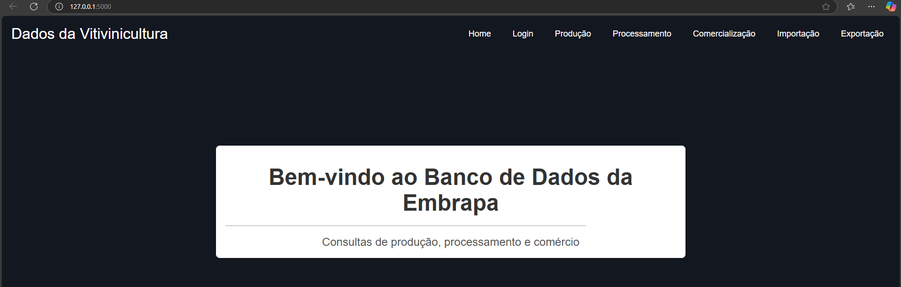

# EmbrapaWineML

** EmbrapaWineML** é um projeto de análise de dados vitivinícolas da Embrapa, desenvolvido como parte de um curso de pós-graduação em Machine Learning Engineering. A API foi criada para consultar dados sobre vitivinicultura, como produção, processamento, comercialização, importação e exportação, com o objetivo de alimentar modelos de Machine Learning para análise preditiva e insights valiosos para o setor.

## Objetivo

Este projeto visa construir uma **Rest API** em Python que consulta os dados vitivinícolas fornecidos pela Embrapa, e serve como base para treinamento de modelos de Machine Learning para análise de dados agrícolas, previsões e otimização de processos relacionados ao setor vitivinícola.

### Funcionalidades

- Consulta pública de dados vitivinícolas da Embrapa.
- Acesso aos seguintes módulos de dados:
  - Produção
  - Processamento
  - Comercialização
  - Importação
  - Exportação
- API Documentada para fácil integração e uso por terceiros.
- Opção de autenticação via Flask Login.
- MVP com deploy em ambiente de produção.

## Tecnologias Utilizadas

- **Python**: Linguagem principal para desenvolvimento da API.
- **Flask**: Framework web para construção da API Rest.
- **SQLAlchemy**: ORM para conexão com banco de dados.
- **Flask Login**: Autenticação.
- **PostgreSQL/MySQL**: Banco de dados para armazenamento dos dados consultados (TBD).


## Instalação

Siga os passos abaixo para rodar a API localmente:

1. Clone o repositório:
    ```bash
    git clone https://github.com/SEU_USUARIO/VitiML-API.git
    cd VitiML-API
    ```

2. Crie e ative um ambiente virtual:
    ```bash
    python3 -m venv venv
    source venv/bin/activate  # No Windows use 'venv\Scripts\activate'
    ```

3. Instale as dependências:
    ```bash
    pip install -r requirements.txt
    ```

4. Execute a API:
    ```bash
    python app.py
    ```

5. A API estará disponível em `http://localhost:5000`.

   

## Endpoints

# Documentação da API - Embrapa Wine ML

## URL Base
A URL base para acessar os endpoints da API é:  
`https://embrapawineml.onrender.com`

---

## Autenticação

A maioria dos endpoints requer autenticação. Utilize o login para obter acesso às funcionalidades protegidas.

### **Login**
**Endpoint**: `/login`  
**Método**: `POST`  
**Descrição**: Autentica o usuário e redireciona para a página inicial.  

**Parâmetros de Formulário**:
- `username` (string): Nome do usuário (`admin@teste`).
- `password` (string): Senha do usuário (`senha123`).

---

## Endpoints

### **Página Inicial**
**Endpoint**: `/`  
**Método**: `GET`  
**Descrição**: Retorna a página inicial do sistema.  

---

### **Produção**

#### 1. Dados de Produção por Ano
**Endpoint**: `/api/producao`  
**Método**: `GET`  
**Descrição**: Retorna os dados da produção para um ano específico.

**Parâmetros de Consulta**:
- `ano` (string, opcional): Ano dos dados desejados (padrão: `2023`).

**Resposta**:
- Código `200`: Dados de produção no formato JSON.
- Código `500`: Erro ao buscar dados.

---

#### 2. Produção por Ano
**Endpoint**: `/producao/<int:ano>`  
**Método**: `GET`  
**Descrição**: Retorna os dados de produção para um ano específico.

**Parâmetros**:
- `ano` (int): Ano dos dados desejados.

**Resposta**:
- Código `200`: Dados de produção no formato JSON.
- Código `500`: Erro ao buscar dados.

---

#### 3. Download de Produção em CSV
**Endpoint**: `/producao_csv`  
**Método**: `GET`  
**Descrição**: Baixa e processa o arquivo CSV com os dados de produção.

**Resposta**:
- Código `200`: Dados de produção no formato JSON.
- Código `500`: Erro ao acessar ou processar o CSV.

---

### **Processamento**

#### 1. Processamento por Ano e Opção
**Endpoint**: `/api/processamento`  
**Método**: `GET`  
**Descrição**: Retorna os dados de processamento para o ano e a opção especificados.

**Parâmetros de Consulta**:
- `ano` (int, obrigatório): Ano dos dados desejados.
- `opcao` (string, obrigatório): Opção específica do processamento.

**Resposta**:
- Código `200`: Dados de processamento no formato JSON.
- Código `400`: Parâmetros obrigatórios ausentes.
- Código `500`: Erro ao buscar dados.

---

#### 2. Download de Processamento em CSV
**Endpoint**: `/processamento_csv`  
**Método**: `GET`  
**Descrição**: Baixa e processa o arquivo CSV com os dados de processamento.

**Resposta**:
- Código `200`: Dados de processamento no formato JSON.
- Código `404`: Nenhum dado encontrado.
- Código `500`: Erro ao acessar ou processar o CSV.

---

### **Comercialização**

#### 1. Dados de Comercialização por Ano
**Endpoint**: `/api/comercializacao`  
**Método**: `GET`  
**Descrição**: Retorna os dados de comercialização para um ano específico.

**Parâmetros de Consulta**:
- `ano` (string, opcional): Ano dos dados desejados (padrão: `2023`).

**Resposta**:
- Código `200`: Dados de comercialização no formato JSON.
- Código `500`: Erro ao buscar dados.

---

#### 2. Comercialização por Ano
**Endpoint**: `/comercializacao/<int:ano>`  
**Método**: `GET`  
**Descrição**: Retorna os dados de comercialização para um ano específico.

**Parâmetros**:
- `ano` (int): Ano dos dados desejados.

**Resposta**:
- Código `200`: Dados de comercialização no formato JSON.
- Código `500`: Erro ao buscar dados.

#### 3. Download de Comercialização em CSV
**Endpoint**: `/comercializacao_csv`  
**Método**: `GET`  
**Descrição**: Baixa e processa o arquivo CSV com os dados de comercialização.

**Resposta**:
- Código `200`: Dados de comercialização no formato JSON.
- Código `500`: Erro ao acessar ou processar o CSV.
---

### **Importação**

#### 1. Importação por Ano e Opção
**Endpoint**: `/api/importacao`  
**Método**: `GET`  
**Descrição**: Retorna os dados de importação para o ano e a opção especificados.

**Parâmetros de Consulta**:
- `ano` (int, obrigatório): Ano dos dados desejados.
- `opcao` (string, obrigatório): Opção específica da importação.

**Resposta**:
- Código `200`: Dados de importação no formato JSON.
- Código `400`: Parâmetros obrigatórios ausentes.
- Código `500`: Erro ao buscar dados.

---

#### 2. Download de Importação em CSV
**Endpoint**: `/importacao_csv`  
**Método**: `GET`  
**Descrição**: Baixa e processa o arquivo CSV com os dados de importação.

**Resposta**:
- Código `200`: Dados de importação no formato JSON.
- Código `404`: Nenhum dado encontrado.
- Código `500`: Erro ao acessar ou processar o CSV.

---

## Restrições de Acesso
Todos os endpoints, exceto `/login` e `/`, exigem autenticação via login. Certifique-se de estar autenticado antes de realizar as chamadas.

## Tecnologias Utilizadas
- Python (Flask)
- Flask Login


## Como Usar

1. **Autenticação:** Use o endpoint `/login` para autenticar com `username` e `password`.
2. **Consulta de Dados:** Utilize os endpoints de consulta para produção, processamento, comercialização, importação e exportação, especificando o ano ou opção desejada.
3. **Download de CSV:** Para obter dados em formato CSV, acesse os endpoints correspondentes com a opção `/csv`.
4. **API Response:** A API retorna os dados em formato JSON para facilitar a integração.


